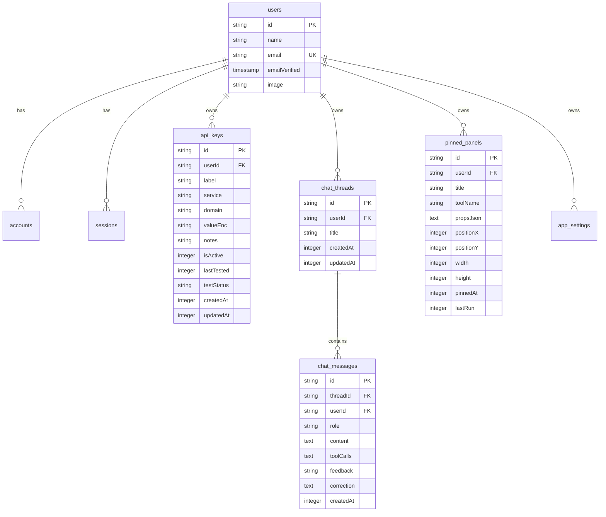

# Gen UI — Database Schema & Data Models Specification

## 1. Overview
Gen UI relies on **Drizzle ORM** configured with PostgreSQL 16. The schema handles user authentication, encrypted credential storage, conversational chat threads and message history, pinned workspace dashboard canvas state, and user application settings.

---

## 2. Schema Specification (`src/db/schema.ts`)

---

## 3. Detailed Data Models

### Authentication Tables
- **`users`**: User account records mapped to NextAuth providers.
- **`accounts`**: OAuth provider links (GitHub Client ID & tokens).
- **`sessions`**: Active authentication sessions with expiration timestamps.
- **`verificationTokens`**: Verification tokens for passwordless / email flows.

### Application Core Tables
- **`api_keys`**: Secret API key vault storing AES-256-GCM encrypted strings (`valueEnc`), service labels, active status, and automated test metrics.
- **`chat_threads`**: Conversational threads grouping user & assistant message turns.
- **`chat_messages`**: Granular message turns with role (`user` | `assistant` | `tool`), text content, JSON tool invocations array (`toolCalls`), user rating (`feedback`: `up` | `down`), and self-correction instructions.
- **`pinned_panels`**: Interactive canvas dashboard panels with saved layout positions (`positionX`, `positionY`, `width`, `height`), tool identifier (`toolName`), and component props (`propsJson`).
- **`app_settings`**: Per-user preferences (key-value store, dark/light theme, default LLM provider).

---

## 4. Migration & Maintenance Commands
- **Generate Migrations**: `npx drizzle-kit generate`
- **Push Schema Changes**: `npx drizzle-kit push`
- **Database Studio GUI**: `npx drizzle-kit studio`
